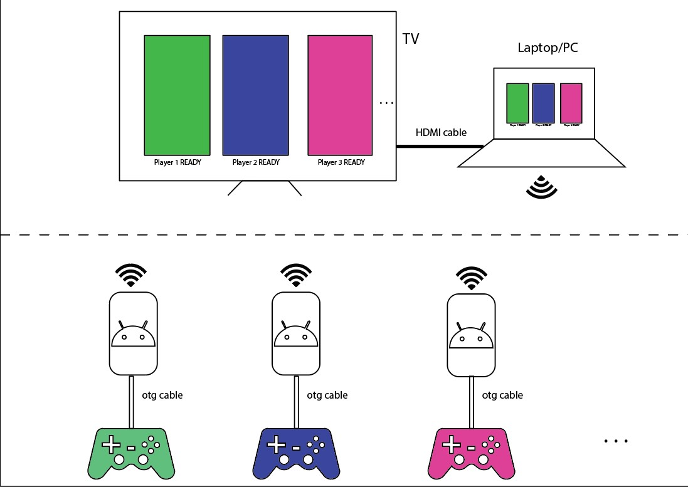

# DroidAsController

Turns Wired Gamepad into Wireless using Android.
Have to plug your gaming pc to the tv, want to play in the couch, but don't have a wireless controller ?

## How it works
* Android acts as a usb host for the controller, gets data from controller and sends it to pc wirelesslly over tcp channel
* Pc gets the data and feeds it to vJoy,a virtual controller software.
* x360ce makes any device act as a xbox 360 controller, we can map our buttons and axis correctly using x360ce or in steam big picture mode.
## Project IN PROGRESS, but working
* You might have to make slight changes to the code to make it work for you.Code is not too complex.
* Refer to Resources.
## Use 
* [Download](https://github.com/PsychedelicOrange/DroidAsController/releases)
* Install App on android device. Give permission to access Controller.
* Download java, vJoy, and x360ce.
* Connect the phone and pc to same wifi.
* After controller is connected to android and app is running , run the app on pc and enter the device ip , press connect.

## NOTES
* If you want the app to open automatically after your controller is connected, note down the product and vendor id , add it to xml/device_filter.xml
* Check on auto connect to keep trying to contact server after (accidental) disconnect.
## Credits
Thanks to https://github.com/MohamedMassoud/Android-Gamepad-To-PC
& https://github.com/rlj1202/JvJoyInterface
Reverse engineered this one cause it was'nt open source and did'nt work with many buttons on my controller.
## Resources
### ANDROID
* https://developer.android.com/guide/topics/connectivity/usb/host
* https://developer.android.com/develop/ui/views/touch-and-input/game-controllers/controller-input
### USB
* https://www.beyondlogic.org/usbnutshell/usb4.shtml
* https://www.partsnotincluded.com/understanding-the-xbox-360-wired-controllers-usb-data/
* https://www.keil.com/pack/doc/mw/USB/html/_u_s_b__configuration__descriptor.html
### MISCELLANIOUS
* https://developer.android.com/studio/command-line/adb

## Further work
* Add vibration / rumble support
* Find way to run java apps without command prompt window.
* Support for multiple controllers
